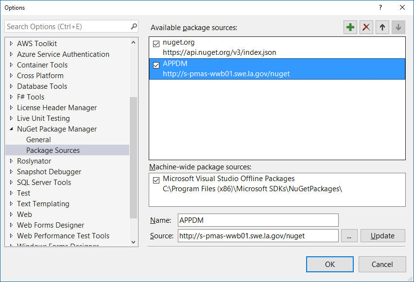

# Installation

1. Setup APPDM nuget server as a package source in Visual Studio



   
2. Change package source to APPDM


    
3. Find SAML2Core package and install


# Usage
1. Modify `ConfigureServices()` in Startup.cs

```cs
services.AddAuthentication(sharedOptions =>
{
    sharedOptions.DefaultScheme = CookieAuthenticationDefaults.AuthenticationScheme;
    sharedOptions.DefaultSignInScheme = CookieAuthenticationDefaults.AuthenticationScheme;
})
.AddSamlCore(options =>
{
    // SignOutPath (REQUIRED) - The endpoint for the idp to perform its signout action
    options.SignOutPath = "/signedout";

    // EntityId (REQUIRED) - The Relying Party Identifier e.g. https://my.la.gov.local
    options.ServiceProvider.EntityId = Configuration["AppConfiguration:ServiceProvider:EntityId"];

    // There are two ways to provide FederationMetadata
    // Option 1 - A FederationMetadata.xml already exists for your application
    // options.MetadataAddress = @"FederationMetadata.xml";

    // Option 2 - Have the middleware generate the FederationMetadata.xml file for you
    options.MetadataAddress = Configuration["AppConfiguration:IdentityProvider:MetadataAddress"];

    // Have the middleware create the metadata file for you
    // The default is false. If you don't want a file generated by the middleware, comment the line below.
    options.CreateMetadataFile = true;

    // If you want to specify the filename and path for the generated metadata file do so below:
    //options.DefaultMetadataFileName = "MyMetadataFilename"; //the default is "Metadata".
    //options.DefaultMetadataFolderLocation = "MyPath"; //the default is "wwwroot" so it can be accessible via https://[host name]/MyMetadataFilename.xml.

    //************************************************************************************************************ 
    // The following section is if your application (SP) has a certificate and is signing the Authn Request with it.
    //************************************************************************************************************
    // Certificate (REQUIRED) if you want you application (SP) to sign the authentication request (AuthnRequest)
    // The certificate serial number value. 

    // PRE-REQUISITE: Install your certificate in your server/local certificate store under the Trusted Root folder.
    // The middleware searches by default by serial number in the Trusted Root folder. This can be changed by:
    // options.ServiceProvider.CertificateStoreName = StoreName.Root;
    // options.ServiceProvider.CertificateStoreLocation = StoreLocation.LocalMachine
    // options.ServiceProvider.CertificateStoreLocation.HashAlgorithm = HashAlgorithmName.SHA256
                
    options.ServiceProvider.SigningCertificateX509TypeValue = Configuration["AppConfiguration:ServiceProvider:CertificateSerialNumber"]; //your certifcate serial number (default type which can be chnaged by ) that is in your certficate store

    // For signed AuthnRequest - if you want the search for the Sp certificate by somethign else other than SerialNumber. The default is serial number. 
    //options.ServiceProvider.CertificateIdentifierType = X509FindType.FindBySerialNumber; // the default is 'X509FindType.FindBySerialNumber'. Change value of 'options.ServiceProvider.SigningCertificateX509TypeValue' if this changes
    
    //************************************************************
            
    // Force Authentication (optional) - if you are requiring users to log into the Idp every time. Default is set to true
    options.ForceAuthn = true;

    // Service Provider Properties (optional) - These set the appropriate tags in the metadata.xml file
    options.ServiceProvider.ApplicationProductionURL = "https://my.la.gov"; // this will create a production signin endpoint on the Idp side. This will be used when deployed to your production site
    options.ServiceProvider.ApplicationStageURL = "https://dev.my.la.gov"; //this will create a stage signin endpoint on the Idp side. This will be used when deployed to your stage site
    options.ServiceProvider.ServiceName = "My Test Site";
    options.ServiceProvider.Language = "en-US";
    options.ServiceProvider.OrganizationDisplayName = "Louisiana State Government";
    options.ServiceProvider.OrganizationName = "Louisiana State Government";
    options.ServiceProvider.OrganizationURL = "https://my.test.site.gov";
    options.ServiceProvider.ContactPerson = new ContactType()
    {
        Company = "Louisiana State Government - OTS",
        GivenName = "Dina Heidar",
        EmailAddress = new[] { "dina.heidar@la.gov" },
        contactType = ContactTypeType.technical,
        TelephoneNumber = new[] { "+1 234 5678" }
    };

    // Events - Modify events below if you want to log errors, add custom claims, etc.

    //options.Events.OnRemoteFailure = context =>
    //{
    //TODO: do whatever you want here if you need to re-direct to somewhere if there 
    // an error from provider
    //    context.Response.Redirect(new PathString("/Account/Login"));
          context.HandleResponse();
    //    return Task.FromResult(0);
    //};              
    //options.Events.OnTicketReceived = context =>
    //{  
    //TODO: add custom claims here
    //    var identity = (ClaimsIdentity)context.Principal.Identity;
    //    identity.RemoveClaim(identity.FindFirst(ClaimTypes.Name)); //remove the screen name to add full name
    //    identity.AddClaim(new Claim(ClaimTypes.Name, context.User["name"].ToString()));
    //    return Task.FromResult(0);
    //};               
})
.AddCookie();
```

2. Modify `Configure()` in Startup.cs

Don't forget to add the following line in `Configure()`

```cs
app.UseAuthentication();
```